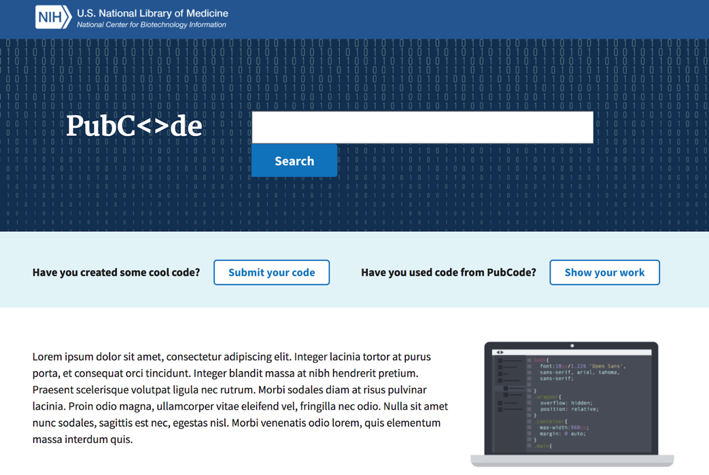

# PubCode :book: :computer:
**A Platform for the Scientific Community**
---  

## Introduction
PubCode is a prototype platform for developers to present their code in a formal environment, while showcasing useful metadata regarding the development, upkeep, and activity levels of their code to prospective users.  Enhancing the users search for an appropriate tool for their given task provides an incentive to cite these open source tools, providing further interest in both its use and development.  

This site demos a selection of software with both scientific publications and GitHub repositories.  Though limited, users can search for tools by keyword and further limit their research results based on metadata concerning how thoroughly the code is being maintained and used. Moreover, users can obtain clusters of similar code as a proxy to the uniqueness of the software, and also determine whether the use and popularity of the software is increasing or decreasing in recent years among its cohort of similar software .

## What’s the Problem?
Computational analysis of biological and clinical data is becoming more important. As a result, researchers often find themselves needing code to complete a specific task, but find that much of the available code is not well-documented, maintained, or user-friendly. Allowing researchers to search for code and quickly limit the results based on how user-friendliness (such as reproducible examples), upkeepness (such as closed issues on GitHub), and popularity (such as number of stars on GitHub and/or number of citations on peer-reviewed papers) would greatly benefit their search experience. At the same time, the existence of this platform and the knowledge that users search based on these metadata would potentially motivate developers to develop code that is better documented, maintained, and user-friendly.

## Metadata on PubCode
- PubMed Citations
  - Collected for each year to assess changes
- Impact Factor of Journal (2016)
- Stars on GitHub
- Commits on GitHub
- Forks on GitHub
- Installation Instructions (Yes/No)
- Examples (Yes/No)
- Sample Data (Yes/No)
- Open Source (Yes/No)
- Open Issues on GitHub
- Closed Issues on GitHub
- Uniqueness
  - Determined by clustering similar codes

